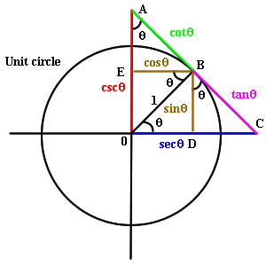

# Trigonometry

*[Home](../README.md)* &nbsp; › &nbsp; 
*[Maths](./maths.md)* &nbsp; › &nbsp; 
*Trigonometry*

---

Trigonometry has 3 main functions, with an equivalent for the complementary angle.



### Sine (sin) and Cosine (cos)
```math
\sin(x)
```
```math
\cos(x)
```


### Tangent (tan) and Cotangent (cot)
```math
\tan(x)
```
```math
\cot(x)
```

### Secant (sec) and Cosecant (csc)

```math
\sec(x)
```
```math
\csc(x)
```
